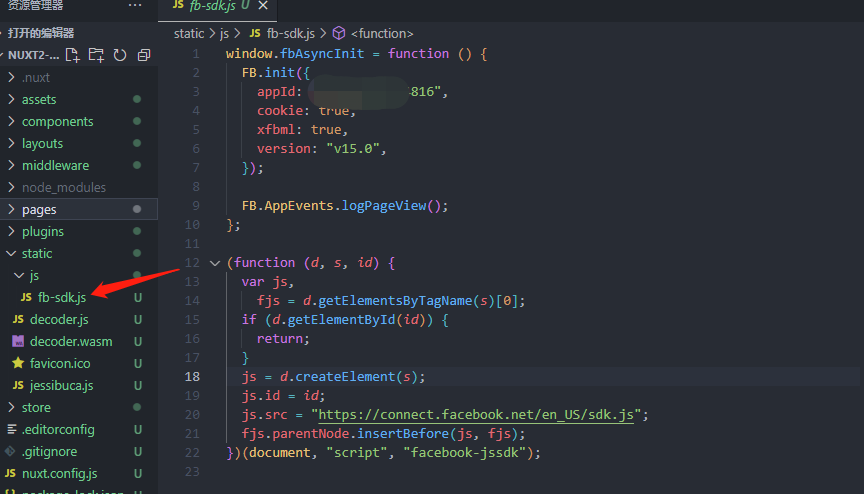

## 开启 Facebook OAuth 服务

访问 [https://developers.facebook.com/docs/facebook-login/web](https://developers.facebook.com/docs/facebook-login/web) 进行开启。<br/>
如果没有 Facebook 开发者账号则需要先进行注册登录。

### 创建一个 Facebook 应用

1. 访问[创建应用](https://developers.facebook.com/apps),并且点击右上角的创建应用按钮。
2. 选择消费者类型后继续。
3. 填写应用名称以及联系邮箱,然后创建应用。 
4. 为应用添加产品,我们这里选择 Facebook 登录. 
5. 选择网络,www 图图标。

### 快速启动

这里按照 facebook 步骤一步一步来即可

1. 提供 web 应用的线上地址 <br/>
   > 注意:
   >
   > - 域名白名单需要填写项目线上的域名,例如(https://www.baidu.com),必须设置 https,不然无效。
   > - 本地测试 localhost 是 http 协议,所以如果要在本地进行调试则需要 **mkcert** 工具将本地开发环境的改成 `https://localhost:3000` 这种,具体流程可参考 [在本地 localhost 开发时也可以有 https 凭证](http://www.xxgw.fun/posts/mkcert-usehttpswork)。

点击 Save 后点击继续进入下一步

2. 设置 Facebook SDK
   

- 这里可以将代码复制下来。然后进入到 Nuxt 的项目当中。<br/>
- 由于需要将这段 script 脚本注入到 index.html 文件当中,所以我们可以在 Nuxt 项目的 static 文件夹中新建一个 js 文件夹,在 js 文件夹中新建一个 fb-sdk.js 的文件。并且将刚刚复制的代码放进去。然后还需要将 appId 改成你自己应用的应用编号。version 改成 "v15.0"就可
  > 应用编号可以在我的应用中查看
  > 
  > js 文件存放位置
  >  > _在 js 中需要将复制代码中的 script 标签去掉_
- 然后在 nuxt.config.js 文件当中进行配置,将刚刚的文件以 script 的方式注入到 index.html 文件当中
- 另外还需要将按钮的具体样式也要注入到 script 当中

```js
export default {
  ...
  head: {
    ...
    script: [
      {
        src: '/js/fb-sdk.js',
      },
      {
        src: "https://connect.facebook.net/zh_CN/sdk.js#xfbml=1&version=v15.0&appId=yourId&autoLogAppEvents=1",
        nonce: "your nonce",
        crossorigin: "anonymous",
        async: true,
        defer: true,
      },
    ],
  }
}
```

3. 检查登录状态
   回到 Facebook 开发者后台后点击继续进入到*检查登录状态这个流程*来根据文档进行后续操作<br/>
   整理一下,按照要求回到 Nuxt 项目中,先创建一个 FacebookLogin.vue 的组件来专门编写 facebook 的登录逻辑。
   FacebookLogin.vue

```js
<template>
  <div>
    Facebook Login
    <div
      class="fb-login-button"
      data-width="300"
      data-size="large"
      data-button-type="login_with"
      data-layout="rounded"
      data-use-continue-as="true"
      onlogin="checkLoginState()"
    ></div>
    <div style="width:1000px;">LoginData:{{ loginData.status }}</div>
  </div>
</template>

<script>
export default {
  data() {
    return {
      loginData: {},
    };
  },
  mounted() {
    if (!process.client) return;
    window.fbAsyncInit();
    this.getLoginStatus();
    window["checkLoginState"] = () => {
      this.getLoginStatus();
    };
  },
  methods: {
    getLoginStatus() {
      let that = this;
      window.FB.getLoginStatus((facebookRes) => {
        that.loginData = facebookRes;
      });
    },
  },
};
</script>
```

这个时候页面上就会有 facebook 登录的按钮了

- 具体的按钮样式可以参阅 facebook 的[关于“登录”按钮的文档](https://developers.facebook.com/docs/facebook-login/web/login-button)
- 在 mounted 钩子中首先需要先判断是否是服务端渲染,如果在服务端则直接跳过就行。
  1. 之前已经在 index.html 中注入了 facebook SDK 的 js 逻辑,所以可以直接调用 window 的 fbAsyncInit 方法进行初始化。
  2. 初始化完成之后可以先获取当前的登录状态,也是通过 window 调用 FB 的 getLoginStatus 方法,在这个方法中可以获取到 facebook 的登录信息。
  3. 通过这个信息可以判断用户是否登录,第一次进入肯定是没有登录。所以页面中显示的 data 状态是*unknown*
     

4. 登录
   点击登录按钮后,与 google 一样会在当前页面中弹出小窗口进行登录操作。<br/>
   
   
   登录成功之后,在页面中的状态就会变成 connected,这是在 template 中的 facebook 中按钮中注册了 onlogin 的回调 fn。登录成功后会调用 checkLoginState 方法,而这个方法要想给 Facebook 调用到需要将这个方法挂载到 window 上,这个在 mounted 生命周期中做了,在这个方法中就可以再去获取一下 facebook 的登录状态来更新 facebook 的登录信息。<br/>
   这些信息不止有连接的状态,还有一些登录的 OAuth 凭证,而前端只需要将这个凭证通过 api 接口给到后端同学去进行鉴权的处理即可。

5. 页面刷新后

当我们刷新页面后,由于之前我们已经登录过,而这个登录的 OAuth 还没有过期,所以可以进行一键登录的操作。<br/>
而且 Facebook 的登录按钮还可以记住你之前登录的用户的信息<br/>
在这时用户点击*以${name}的身份继续*按钮时,我们要做的就是获取登录的信息来得到OAuth,然后后续与登录一样请求后端接口即可

**至此Nuxt 集成Facebook第三方登录的功能已经全部完成了***★,°*:.☆(￣▽￣)/$:*.°★* 。
