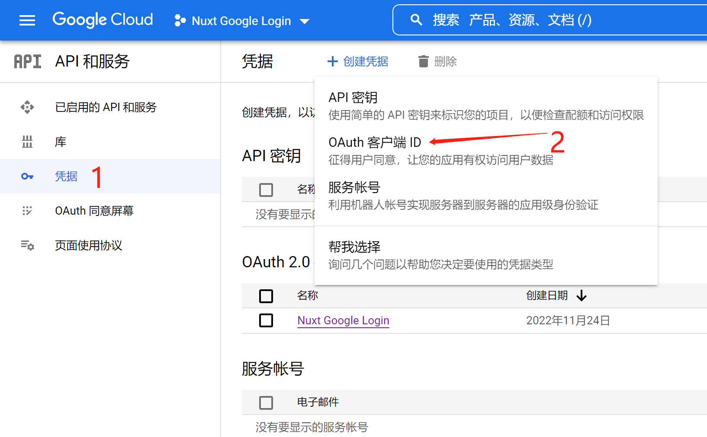
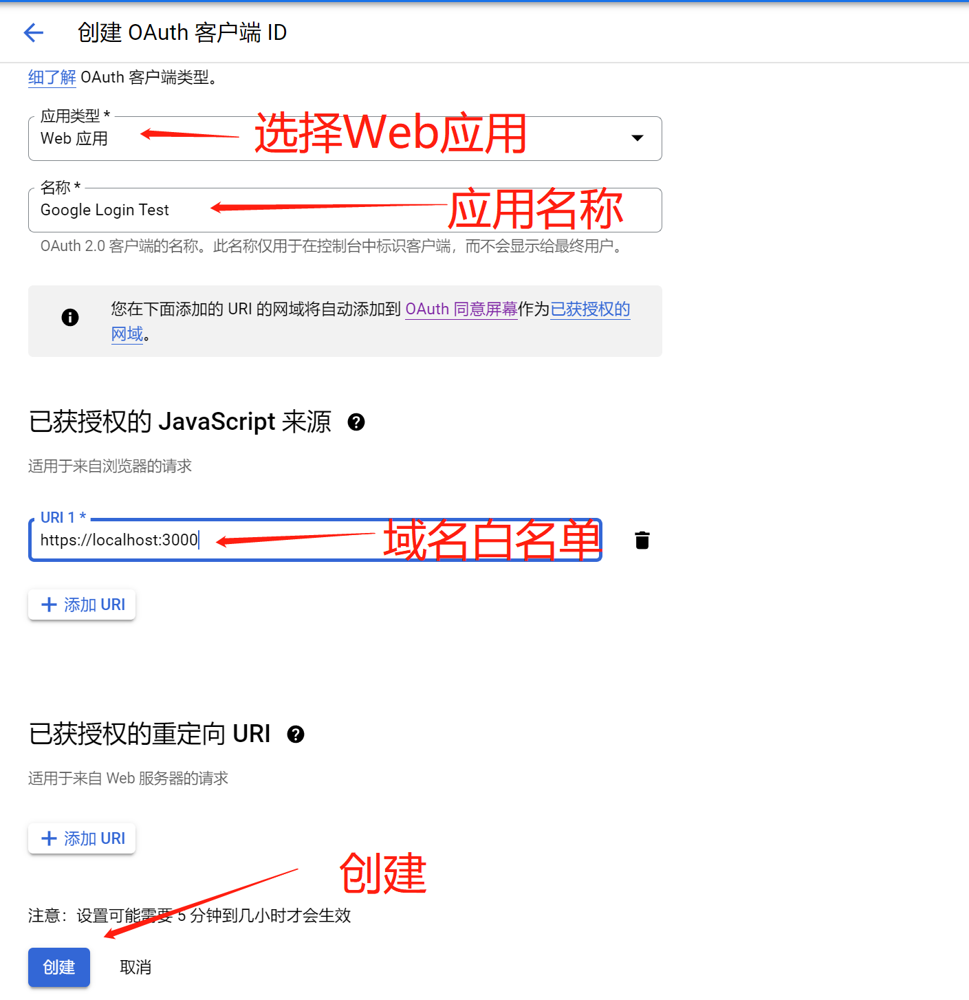
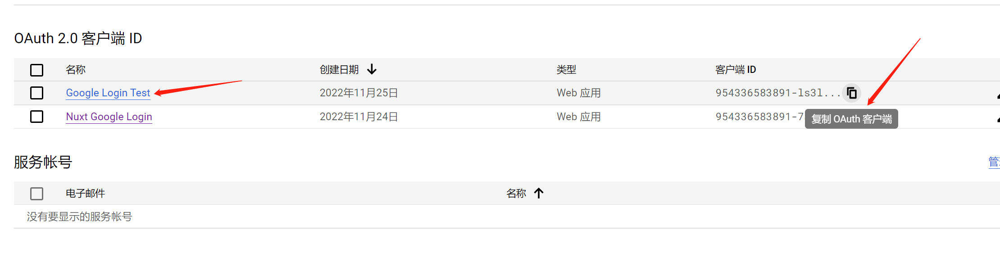
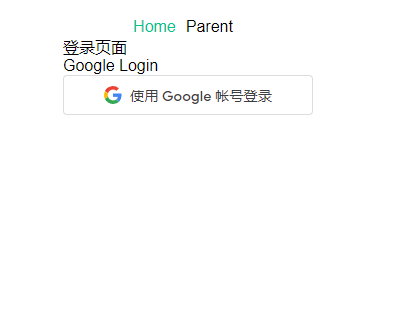
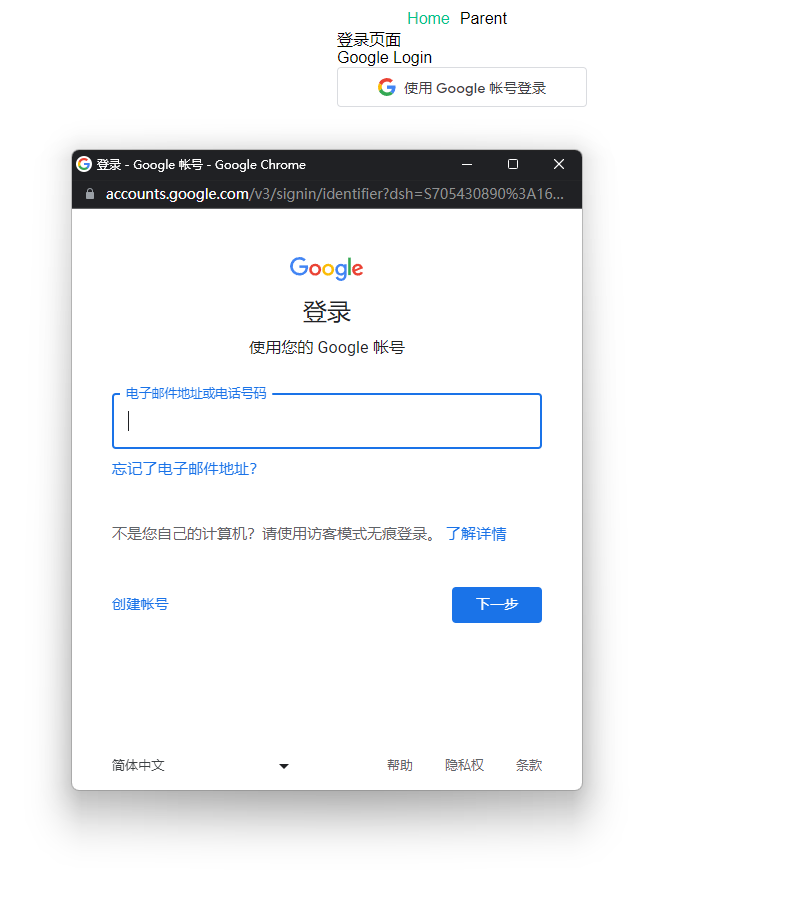
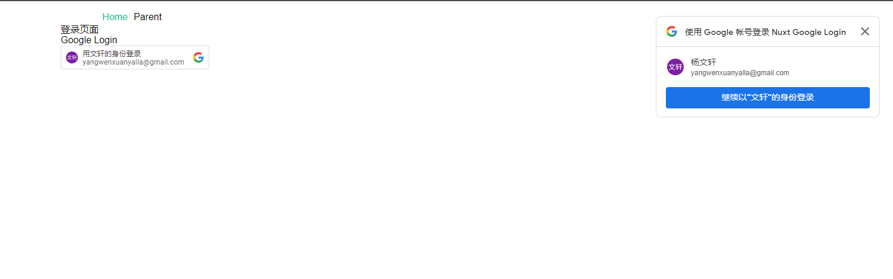

## 开启 Google OAuth 服务

访问 [https://console.cloud.google.com/apis/credentials](https://console.cloud.google.com/apis/credentials) 进行开启。<br/>
如果没有 Google 开发者账号则需要先进行注册登录。

### 创建凭据



### 创建 OAuth 客户端



1. 域名白名单需要填写项目线上的域名,例如(https://www.baidu.com),必须设置 https,不然无效。
2. 域名白名单可以填写多个。
3. 本地测试 localhost 是 http 协议,所以如果要在本地进行调试则需要 **mkcert** 工具将本地开发环境的改成 `https://localhost:3000` 这种,具体流程可参考 [在本地 localhost 开发时也可以有 https 凭证](http://www.xxgw.fun/posts/mkcert-usehttpswork)。

### 创建完成


创建完成后就可以看见控制台中新增了刚刚创建的应用,我们需要的就是将 OAuth 客户端 ID 复制保存下,后续需要用上。<br/>
至此 Google OAuth 服务已经开启完成

## 集成到 Nuxt 项目中

### 将 **gsi** 引入到应用当中

nuxt.config.js

```js
export default {
  ...
  head: {
    ...
    script: [
      {
        src: 'https://accounts.google.com/gsi/client',
      },
    ],
  }
}
```

这个脚本会在 html 中暴露一些 google 的全局方法。

### 创建一个 Google 组件

components/GoogleLogin.vue

```js
<template>
  <div>
    <div id="googleButton"></div>
  </div>
</template>
```

### 初始化Google
在 mounted 生命周期钩子中,初始化 Google 登录以及渲染 Google 登录按钮

```js
<template>
  <div>
    <div id="googleButton"></div>
  </div>
</template>

<script>
export default {
  mounted() {
    // initialize Google Sign in
    google.accounts.id.initialize({
      client_id: "Your Client ID",
      callback: this.handleCredentialResponse, //method to run after user clicks the Google sign in button
      context: "signin",
    });
    google.accounts.id.prompt()

    // render button
    google.accounts.id.renderButton(document.getElementById("googleButton"), {
      type: "standard",
      size: "large",
      text: "signin_with",
      shape: "rectangular",
      logo_alignment: "center",
      width: 250,
    });
  },

  methods: {
    handleCredentialResponse(response) {
      // call your backend API here
      // the token can be accessed as: response.credential
      console.log(response);
    },
  },
};
</script>
```
- 需要在将client_id 改成之前创建google应用时保存的ID。

这样在页面中就可以看到显示了Google渲染的登录按钮了


- 点击登录

google会将登录逻辑以一个小弹窗窗口的形式展现<br/>
登录成功之后会发现控制台打印了一段信息,这个是代码中`handleCredentialResponse`回调触发了,从而可以进行判断是否登录成功。前端要做的就是在回调中将google回传给我们的`credential`通过请求接口穿给我们的后台同学,让他们进行信息的验证以及自己平台注册或者登录的操作。


### 一键登录
此时如果用户刷新页面的话,由于之前我们的凭证还没有过期,所以可以不用重复进行google账号的登录,用户可以使用之前身份进行一键登录

- 右上角的弹窗`google.accounts.id.prompt()`起的作用<br/>
一键登录成功后同样也会触发`handleCredentialResponse`回调,然后再进行后续的操作即可

**至此Nuxt 集成Google第三方登录的功能已经全部完成了***★,°*:.☆(￣▽￣)/$:*.°★* 。